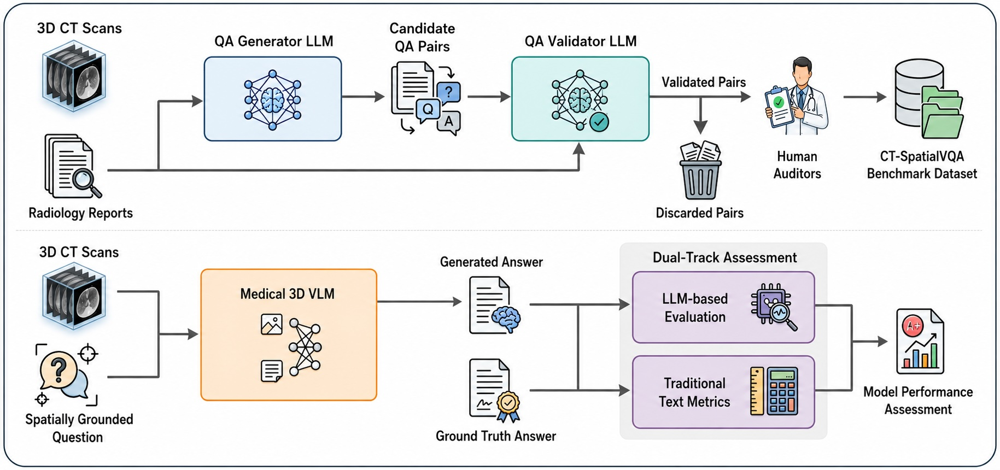

<h1 align="center">Lost in Volume: The CT-SpatialVQA Benchmark</h1>

<p align="center">
  <b>Evaluating Semantic-Spatial Understanding of 3D Medical Vision–Language Models</b><br>
  <i>MICCAI 2026</i>
</p>

<p align="center">
  <a href="https://arxiv.org/abs/2605.08787"></a>
  &nbsp;
  <a href="https://huggingface.co/datasets/Mashrafi2827/CT-SpatialVQA"></a>
  &nbsp;
  <a href="https://mashrafi27.github.io/CT-SpatialVQA/"></a>
</p>

<p align="center">
  
</p>

---

## Overview

**CT-SpatialVQA** is a clinically grounded benchmark for systematically evaluating **semantic-spatial reasoning** in 3D medical vision–language models (VLMs). Despite strong performance on VQA and report generation, we show that current 3D medical VLMs fail severely on spatially grounded questions — averaging **34% accuracy** across eight models, often below random.

### Dataset Scale

| QA Pairs | CT Volumes | Spatial Categories | VLMs Benchmarked |
|:--------:|:----------:|:-----------------:|:----------------:|
| **9,077** | **1,601** | **6** | **8** |

### Key Findings

| Human Consensus Rate | Best Model Accuracy | Avg. Accuracy (8 models) |
|:--------------------:|:-------------------:|:------------------------:|
| **95%** | **43.69%** (CT-Chat) | **34%** |

---

## Spatial Reasoning Categories

CT-SpatialVQA covers six clinically relevant spatial primitives required for volumetric spatial integrity in medical VLMs:

| # | Category | What it tests |
|---|----------|--------------|
| 1 | **Laterality & Bilateral Symmetry** | Left/right/bilateral anatomical grounding relative to the sagittal midline |
| 2 | **Longitudinal (Vertical) Position** | Superior/inferior positioning along the cranio-caudal axis; slice-level consistency |
| 3 | **Anterior-Posterior (Depth) Relations** | Front/back orientation; depth cues and compartment-level reasoning across slices |
| 4 | **Medial-Lateral Orientation (Centricity)** | Central/peripheral localization within anatomical reference frames |
| 5 | **Adjacency & Containment** | Topological relations: distinguishing touching from containment within anatomical boundaries |
| 6 | **Spatial Extent & Boundaries** | Regional confinement, compartment crossing, disease spread accuracy |

---

## Results

**Table 1.** Performance of 3D Medical VLMs on CT-SpatialVQA (zero-shot setting). All models fall below **50% accuracy**. Evaluation uses LLM-as-Jury (GPT-4o + Gemini 2.5 Flash + Qwen3 as independent binary judges), alongside standard text similarity metrics.

| Metric | CT-Chat | MERLIN | Med3DVLM | M3D | RadFM | VILA-M3 | MedGemma | MedEvalKit | Avg. |
|--------|:-------:|:------:|:--------:|:---:|:-----:|:-------:|:--------:|:----------:|:----:|
| **LLM as Judge (Gemini)** | **44.68** | 29.85 | 34.55 | 33.04 | 33.36 | 29.49 | 39.30 | 39.96 | 35.53 |
| **LLM as Judge (GPT)** | **41.50** | 29.45 | 31.82 | 31.09 | 31.40 | 28.43 | 40.55 | 39.44 | 34.21 |
| **LLM as Judge (Qwen)** | **45.27** | 30.34 | 32.20 | 31.21 | 32.09 | 27.81 | 37.33 | 41.89 | 34.79 |
| **LLM as Jury** | **43.69** | 28.85 | 31.44 | 30.57 | 31.49 | 28.20 | 38.24 | 40.16 | **34.08** |
| SBERT Cosine Sim. | 0.562 | 0.503 | 0.399 | 0.412 | **0.585** | 0.471 | 0.581 | 0.579 | 0.512 |
| BLEU | 3.29 | 8.11 | 0.56 | 1.08 | **16.45** | 2.51 | 3.07 | 3.46 | 4.82 |
| ROUGE-L | 0.130 | 0.300 | 0.198 | 0.204 | **0.372** | 0.273 | 0.167 | 0.158 | 0.225 |
| METEOR | 0.230 | 0.256 | 0.068 | 0.077 | **0.311** | 0.114 | 0.237 | 0.252 | 0.193 |

---

## Dataset

The dataset is publicly available on HuggingFace: [**Mashrafi2827/CT-SpatialVQA**](https://huggingface.co/datasets/Mashrafi2827/CT-SpatialVQA)

Local files are also provided in `dataset/`. JSONL schema:

```json
{"case_id": "...", "image_path": "...", "question": "...", "answer": "..."}
```

**CT Volumes:** This repository distributes QA pairs only — not the CT volumes themselves. Use the CT-RATE download script in `dataset/` to retrieve the corresponding volumes.

```bash
python dataset/download_ctrate_dataset.py
```

---

## Repository Structure

```
CT-SpatialVQA/
├── dataset/                # QA pairs (JSON/JSONL) + CT-RATE download script
├── QA_generation/          # LLM-based QA generation & validation pipeline
├── benchmarking/           # Inference scripts and evaluation code
│   ├── inference/          # Per-model inference pipelines
│   └── eval_scripts/       # LLM-as-Judge / Jury evaluation
└── Figures/                # Paper figures
```

---

## Citation

If you find CT-SpatialVQA useful in your research, please cite:

```bibtex
@article{monon2026ctspatialvqa,
  title   = {Lost in Volume: The CT-SpatialVQA Benchmark for Evaluating
             Semantic-Spatial Understanding of 3D Medical Vision--Language Models},
  author  = {Monon, Mashrafi and Rahman, Umaima and Hanif, Asif and
             Saeed, Numan and Yaqub, Mohammad},
  journal = {arXiv preprint arXiv:2605.08787},
  year    = {2026}
}
```

<details>
<summary><b>Referenced Works (BibTeX)</b></summary>

```bibtex
@article{ct-rate,
  title={Generalist foundation models from a multimodal dataset for 3D computed tomography},
  author={Hamamci, Ibrahim Ethem and Er, Sezgin and Wang, Chenyu and Almas, Furkan and Simsek, Ayse Gulnihan and Esirgun, Sevval Nil and Dogan, Irem and Durugol, Omer Faruk and Hou, Benjamin and Shit, Suprosanna and others},
  journal={Nature Biomedical Engineering},
  pages={1--19},
  year={2026},
  publisher={Nature Publishing Group UK London}
}

@article{med3dvlm,
  title={Med3dvlm: An efficient vision-language model for 3d medical image analysis},
  author={Xin, Yu and Ates, Gorkem Can and Gong, Kuang and Shao, Wei},
  journal={IEEE Journal of Biomedical and Health Informatics},
  year={2025},
  publisher={IEEE}
}

@article{m3d,
  title={M3d: Advancing 3d medical image analysis with multi-modal large language models},
  author={Bai, Fan and Du, Yuxin and Huang, Tiejun and Meng, Max Q-H and Zhao, Bo},
  journal={arXiv preprint arXiv:2404.00578},
  year={2024}
}

@article{merlin,
  title={Merlin: A vision language foundation model for 3d computed tomography},
  author={Blankemeier, Louis and Cohen, Joseph Paul and Kumar, Ashwin and Van Veen, Dave and Gardezi, Syed Jamal Safdar and Paschali, Magdalini and Chen, Zhihong and Delbrouck, Jean-Benoit and Reis, Eduardo and Truyts, Cesar and others},
  journal={Research Square},
  pages={rs--3},
  year={2024}
}

@article{radfm,
  title={Towards generalist foundation model for radiology by leveraging web-scale 2d\&3d medical data},
  author={Wu, Chaoyi and Zhang, Xiaoman and Zhang, Ya and Hui, Hui and Wang, Yanfeng and Xie, Weidi},
  journal={Nature Communications},
  volume={16},
  number={1},
  pages={7866},
  year={2025},
  publisher={Nature Publishing Group UK London}
}

@inproceedings{vila,
  title={Vila-m3: Enhancing vision-language models with medical expert knowledge},
  author={Nath, Vishwesh and Li, Wenqi and Yang, Dong and Myronenko, Andriy and Zheng, Mingxin and Lu, Yao and Liu, Zhijian and Yin, Hongxu and Law, Yee Man and Tang, Yucheng and others},
  booktitle={Proceedings of the Computer Vision and Pattern Recognition Conference},
  pages={14788--14798},
  year={2025}
}

@article{lingshu,
  title={Lingshu: A generalist foundation model for unified multimodal medical understanding and reasoning},
  author={Xu, Weiwen and Chan, Hou Pong and Li, Long and Aljunied, Mahani and Yuan, Ruifeng and Wang, Jianyu and Xiao, Chenghao and Chen, Guizhen and Liu, Chaoqun and Li, Zhaodonghui and others},
  journal={arXiv preprint arXiv:2506.07044},
  year={2025}
}

@misc{google2026medgemma,
  title        = {MedGemma 1.5 Model Card},
  author       = {{Google Research}},
  year         = {2026},
  url          = {https://huggingface.co/google/medgemma-1.5-4b-it},
  note         = {Accessed: 2026-02-22},
  organization = {Google},
}
```

</details>
